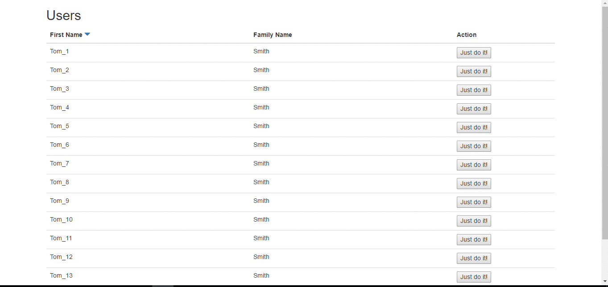

#### NPM package [aurelia-back-to-top](https://www.npmjs.com/package/aurelia-back-to-top)

## What is aurelia-back-to-top plugin?
aurelia-back-to-top is a very simple plugin for [Aurelia](http://aurelia.io/) that adds button for scrolling page back to top. This feature can be easily integrate with [infinite scroll](https://github.com/matik12/aurelia-infinite-scroll) loading many elements into table or any other container. Using this button user will still be able to get back to the top of the page very quickly.

aurelia-back-to-top has very similar functionality as [angular-backtop] (https://github.com/padsbanger/angular-backtop) with one difference - button is visible immediately after the page is scrolled a few pixels, you don't need to scroll page to the bottom.



# Installation prerequisites
Obviously, you need to have installed [NodeJs](https://nodejs.org/) and [Gulp](http://gulpjs.com/). aurelia-infinite-scroll was based on [Aurelia plugin](https://github.com/aurelia/skeleton-plugin) and requires only standard Aurelia libraries except for [jquery](https://jquery.com/). It's highly recommended to use JSPM for package management.

# Installation
```
jspm install npm:aurelia-back-to-top
```
Using Npm:
```
npm install aurelia-back-to-top --save
```

# Usage guide

In your Aurelia configuration file(most commonly main file) add the plugin :
```js
import 'aurelia-back-to-top';

export function configure(aurelia: Aurelia) {
  aurelia.use
    .standardConfiguration()
    .developmentLogging()
    .plugin('aurelia-back-to-top');

  aurelia.start().then(() => aurelia.setRoot());
}
```

Then you can use custom element 'back-to-top' anywhere in the code like this for example:
```js
<template>
    <div class="some-container-with-elements"></div>
	
	<back-to-top></back-to-top>
</template>
```

Inside this custom element is rendered link & icon html shown below.
```js
<a class="back-to-top">
	<i class="fa fa-chevron-circle-up"></i>
</a>
```

By default it uses **font-awesome** classes, but you can change icon class to anything you want i.e. bootstrap using standard glyphicons.
```js
<template>
    <div class="some-container-with-elements"></div>
	
	<back-to-top icon-class="glyphicon glyphicon-triangle-top"></back-to-top>
</template>
```

To make everything work and look pretty, apply your styles to back-to-top element. Sass sample class: 
```js
.back-to-top {
    bottom: 20px;
    color: $color-dark-grey;
    cursor: pointer;
    display: none;
    font-size: 45px;
    opacity: .7;
    position: fixed;
    right: 20px;
    z-index: 5;

    &:hover {
        color: $color-dark-grey;
    }

    @media (min-width: 992px) {
        &:hover {
            color: $color-blue;
        }
    }
}
```

Notice: it is recommended to use use **only one** back-to-top element per html page.

## Browser support

This plugin should work with all modern browsers, although it is still in early phase and can contain few bugs. Current version was tested in IE11, Edge and Chrome.
